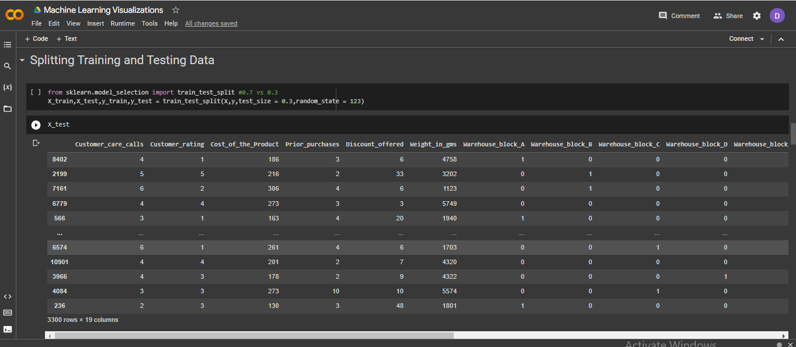
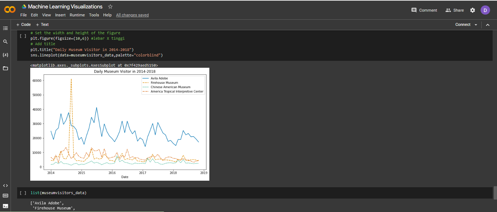

# Portfolio
---
## Machine Learning Visualizations

Machine learning is a branch of artificial intelligence (AI) and computer science which focuses on the use of data and algorithms to imitate the way that humans learn, gradually improving its accuracy. Machine learning is an important component of the growing field of data science. Through the use of statistical methods, algorithms are trained to make classifications or predictions, and to uncover key insights in data mining projects. These insights subsequently drive decision making within applications and businesses, ideally impacting key growth metrics. 

---
## GUI Python for Moving Average (Data : Jumlah Wisatawan Gucci)

**Moving Average:** 

 The moving average is a statistical method used for forecasting long-term trends. The technique represents taking an average of a set of numbers in a given range while moving the range.

 
The steps to Use the Exponential Smoothing GUI 
1. Click the Input File button 
2. Load file 
3. Click the Hitung button

---
